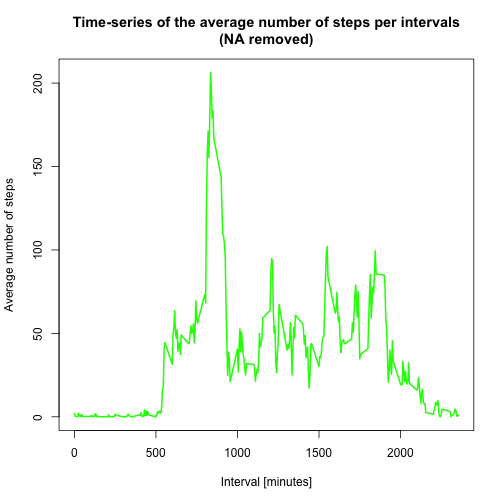
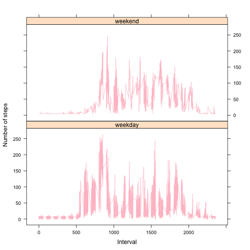

#Loading and preprocessing the data
set the working directory

####1. Load the data(i.e. read.csv()) 


```r
#Load the actiivty data
activity_data <- read.csv("activity.csv", stringsAsFactors=FALSE) 
```

####2. Process/transform the data (if necessary) into a format suitable for analysis

```r
#Changing the date to date format
activity_data$date <- as.POSIXct(activity_data$date, format="%Y-%m-%d")

# Extract weekdays from dates
activity_data <- data.frame(date=activity_data$date, 
                           weekday=tolower(weekdays(activity_data$date)), 
                           steps=activity_data$steps, 
                           interval=activity_data$interval)

# Compute the day type (weekend or weekday)
activity_data <- cbind(activity_data, 
                      daytype=ifelse(activity_data$weekday == "saturday" | 
                                     activity_data$weekday == "sunday", "weekend", "weekday"))

# final activity data frame
activity <- data.frame(date=activity_data$date, 
                       weekday=activity_data$weekday, 
                       daytype=activity_data$daytype, 
                       interval=activity_data$interval,
                       steps=activity_data$steps)
```

#What is the mean total number of steps taken per day?

For this part of the assignment, you can ignore the missing values in the dataset.

####1. Make a histogram of the total number of steps taken each day


```r
# Compute the total number of steps each day (NA values removed)
sum_data <- aggregate(activity$steps, by=list(activity$date), FUN=sum, na.rm=TRUE)

# Rename the attributes
names(sum_data) <- c("date", "total")
```

The histogram is given by the following lines of code:


```r
hist(sum_data$total, 
     breaks=seq(from=0, to=25000, by=2500),
     col="yellow", 
     xlab="Total number of steps", 
     ylim=c(0, 20), 
     main="Histogram of the total number of steps taken each day\n(NA removed)")
```


####2.Calculate and report the mean and median total number of steps taken per day


```r
mean_NA_removed<- mean(sum_data$total)
median_NA_removed<- median(sum_data$total)
```

The mean and meadian number of steps taken per day are 9354.2295082 and 10395 

# What is the average daily activity pattern?
#### 1.Make a time series plot (i.e. type = "l") of the 5-minute interval (x-axis) and the average number of steps taken, averaged across all days (y-axis)


```r
# Compute the means of steps accross all days for each interval
mean_data <- aggregate(activity$steps, 
                       by=list(activity$interval), 
                       FUN=mean, 
                       na.rm=TRUE)

# Rename the attributes
names(mean_data) <- c("interval", "mean")
```

The time serie plot is created by the following lines of code


```r
# Compute the time series plot
plot(mean_data$interval, 
     mean_data$mean, 
     type="l", 
     col="green", 
     lwd=2, 
     xlab="Interval [minutes]", 
     ylab="Average number of steps", 
     main="Time-series of the average number of steps per intervals\n(NA removed)")
```



####2. Which 5-minute interval, on average across all the days in the dataset, contains the maximum number of steps?


```r
# We find the position of the maximum mean
max_pos <- which(mean_data$mean == max(mean_data$mean))

# We lookup the value of interval at this position
max_interval <- mean_data[max_pos, 1]
```

The 5-minute interval that contains the maximum of steps, on average across all days is 835

#Inputing the missing values
Note that there are a number of days/intervals where there are missing values (coded as NA). The presence of missing days may introduce bias into some calculations or summaries of the data.

####1. Calculate and report the total number of missing values in the dataset (i.e. the total number of rows with NA’s)


```r
# We use the trick that a TRUE boolean value is equivalent to 1 and a FALSE to 0.
NA_count <- sum(is.na(activity$steps))
```

The number of NA is 2304

####2. Devise a strategy for filling in all of the missing values in the dataset. The strategy does not need to be sophisticated. For example, you could use the mean/median for that day, or the mean for that 5-minute interval, etc.


```r
# Find the NA positions
na_pos <- which(is.na(activity$steps))

# Create a vector of means
mean_vec <- rep(mean(activity$steps, na.rm=TRUE), times=length(na_pos))
```

We use the strategy to remplace each NA value by the mean of the steps attribute.

####3. Create a new dataset that is equal to the original dataset but with the missing data filled in.


```r
# Replace the NAs by the means
activity[na_pos, "steps"] <- mean_vec
```

####4. Make a histogram of the total number of steps taken each day and calculate and report the mean and median total number of steps taken per day. Do these values differ from the estimates from the first part of the assignment? What is the impact of imputing missing data on the estimates of the total daily number of steps?


```r
# Compute the total number of steps each day (NA values removed)
sum_data <- aggregate(activity$steps, by=list(activity$date), FUN=sum)

# Rename the attributes
names(sum_data) <- c("date", "total")

# Compute the histogram of the total number of steps each day
hist(sum_data$total, 
     breaks=seq(from=0, to=25000, by=2500),
     col="red", 
     xlab="Total number of steps", 
     ylim=c(0, 30), 
     main="Histogram of the total number of steps taken each day\n(NA replaced by mean value)")
```


The mean and median are computed below


```r
mean_NA_replaced <- mean(sum_data$total)
median_NA_replaced<- median(sum_data$total)
```
These formulas give a mean and median of 1.0766189 &times; 10<sup>4</sup> and 1.0766189 &times; 10<sup>4</sup> respectively.

These values differ greatly from the estimates from the first part of the assignment. The impact of imputing the missing values is to have more data, hence to obtain a bigger mean and median value.

#Are there differences in activity patterns between weekdays and weekends?

For this part the 𝚠𝚎𝚎𝚔𝚍𝚊𝚢𝚜() function may be of some help here. Use the dataset with the filled-in missing values for this part.

####1. Create a new factor variable in the dataset with two levels – “weekday” and “weekend” indicating whether a given date is a weekday or weekend day.


```r
# Load the lattice graphical library
library(lattice)

# Compute the average number of steps taken, averaged across all daytype variable
mean_data <- aggregate(activity$steps, 
                       by=list(activity$daytype, 
                               activity$weekday, activity$interval), mean)

# Rename the attributes
names(mean_data) <- c("daytype", "weekday", "interval", "mean")
```

####2. Make a panel plot containing a time series plot (i.e. 𝚝𝚢𝚙𝚎 = "𝚕") of the 5-minute interval (x-axis) and the average number of steps taken, averaged across all weekday days or weekend days (y-axis). See the README file in the GitHub repository to see an example of what this plot should look like using simulated data.
The time series plot take the following form:


```r
# Compute the time serie plot
xyplot(mean ~ interval | daytype, mean_data, 
       type="l", 
       col ="pink",
       lwd=1, 
       xlab="Interval", 
       ylab="Number of steps", 
       layout=c(1,2))
```



